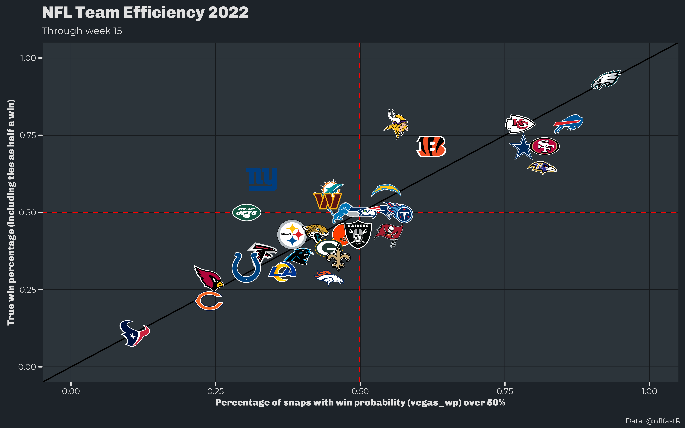
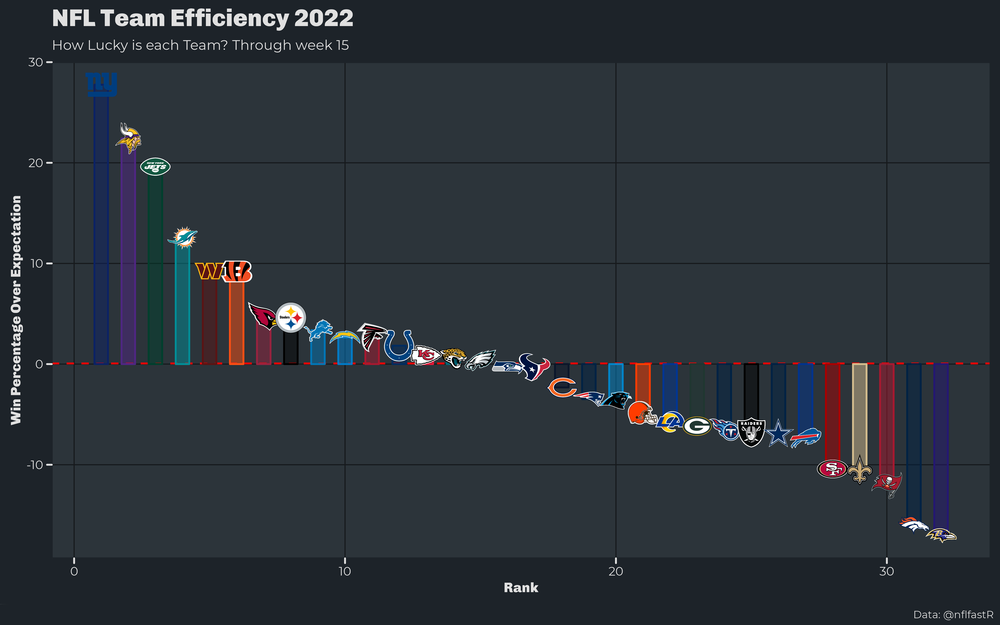
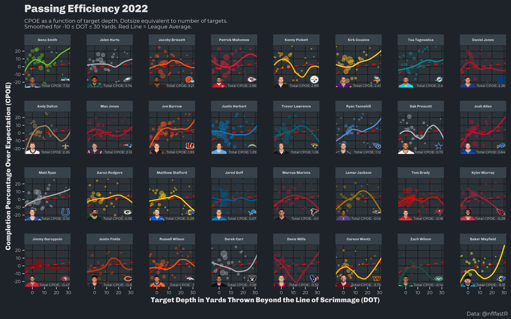

README
================

## Setup/Installation

Most of this repo relies on a personal package I created [InitR](https://github.com/Colinifer/initR) and
[nflfastR](https://twitter.com/mrcaseb/) (by: [@mrcaseb](https://twitter.com/mrcaseb/), [@benbbaldwin](https://twitter.com/benbbaldwin/)). With some simple
setup, most of the scripts will automatically render visualizations from NFL play-by-play data.

# Plots

## Team Wins
### Team wins over/under expected
Which teams has the luckiest/unluckiest records based on W-L and percentage of snaps above 50% on [@nflfastR's](https://github.com/nflverse/nflfastR) win probability model?

Script: [link](plots/scripts/wins_above_expectation.R)
| | |
|:-------------------------:|:-------------------------:|
| | |

## Offensive Passing Efficiency
### QB Passing Efficiency as a function of throwing distance (air yards)

QB completion percentage over expected (CPOE) by depth of target (DOT). A higher CPOE implies the QB completed more passes at the specified range downfield.

Script: [link](plots/scripts/qb_cpoe_adot.R)

### QB CPOE and EPA per dropback by game

A higher CPOE and EPA means the QB completed more passes and a higher expected points per dropback.

Script: [link](https://github.com/Colinifer/football/blob/master/plots/scripts/qb_epa_cpoe.R)

### QB Passing Efficiency compared to ESPN's O-line Pass Block Win Rate

DAKOTA is a composite score created by [Ben Baldwin](https://twitter.com/benbbaldwin) of a QB's completion percentage over expected (CPOE) and expected points added (EPA) per dropback. PBWR is a metric created by ESPN ([Seth Walder et al.](https://www.espn.com/nfl/story/_/id/26888038/pass-blocking-matters-more-pass-rushing-prove-it))

Script: [link](https://github.com/Colinifer/football/blob/master/plots/scripts/qb_efficiency.R)

## Defensive Passing Efficiency
### Defensive Passing Efficiency as a function of throwing distance (air yards).

A lower CPOE means the defense allowed fewer completions than expected per opposing dropback.

Script: [link](https://github.com/Colinifer/football/blob/master/plots/scripts/defense_cpoe_adot.R)

### Defensive CPOE and EPA allowed per dropback by game.

A lower CPOE and EPA means the defense allowed fewer completions and EPA per opposing dropback.

Script: [link](https://github.com/Colinifer/football/blob/master/plots/scripts/defense_epa_cpoe.R)

### Defensive CAYOE

Script: [link](https://github.com/Colinifer/football/blob/master/plots/scripts/defense_cayoe.R)

